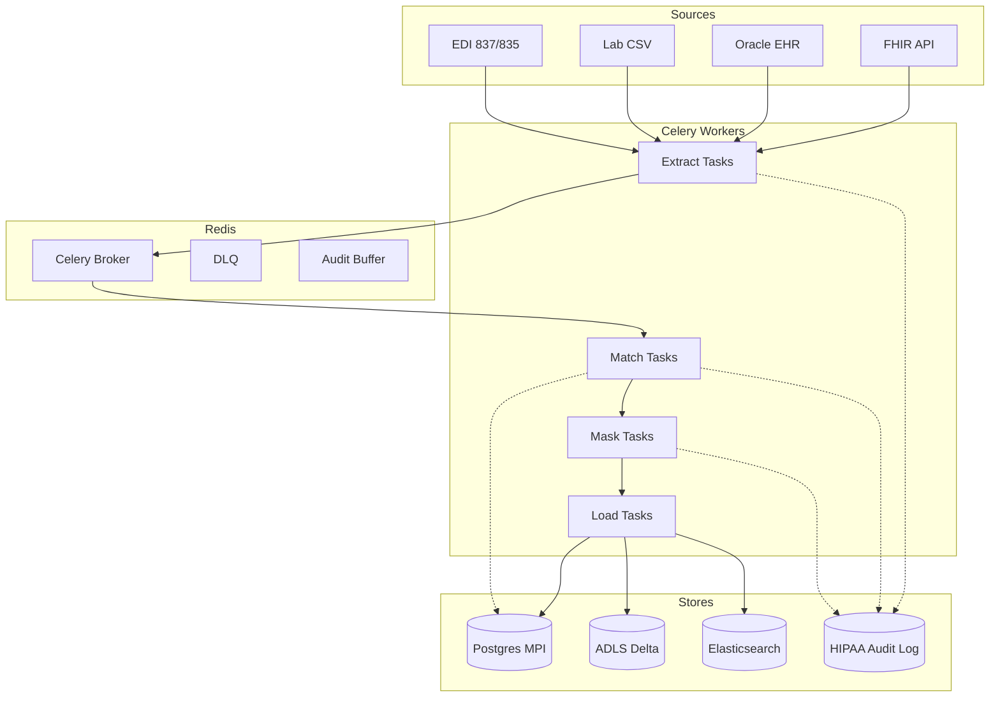

# Clinical ETL Architecture

## Overview

Clinical ETL is a Celery-orchestrated, HIPAA-conscious data integration hub for healthcare data sources.

## Component Diagram



## Key Design Decisions

| Decision | Rationale |
|---------|-----------|
| Celery over Airflow | Healthcare workloads are event-driven (FHIR webhooks, EDI file drops); Celery's task-queue model fits better than batch DAGs. |
| Master Patient Index in Postgres | ACID-compliant upserts, mature JOIN performance for matching. |
| Delta on ADLS | Schema evolution, time-travel for audit, compatible with Databricks/Synapse. |
| Elasticsearch for search | Free-text patient search by provider during care delivery. |
| Hash-based name comparison | Production: keep an isolated unmasked side-table for matching only; everything else uses hashes. |

## HIPAA Audit Trail

Every PHI access (extract, match, mask, load) writes an immutable JSONL event:

```json
{
  "ts": "2026-05-20T10:00:00Z",
  "actor": "clinical_etl_etl",
  "action": "READ",
  "resource_type": "Patient",
  "resource_id": "FHIR-P-001",
  "purpose": "OPERATIONS",
  "source": "FHIR",
  "metadata": {...}
}
```

Audit log is **append-only**, stored on local disk in dev (`logs/hipaa_audit.jsonl`) and on S3 with object lock in production.

## SLA & Targets

| Metric | Target |
|--------|--------|
| Patient match accuracy | > 99% (manual review of 0.1% sample) |
| Pipeline latency (FHIR) | < 15 min from source update |
| EDI 837/835 reconciliation | T+1 day |
| PHI masking error rate | 0 (mandatory pre-load gate) |
